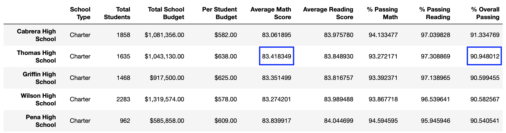
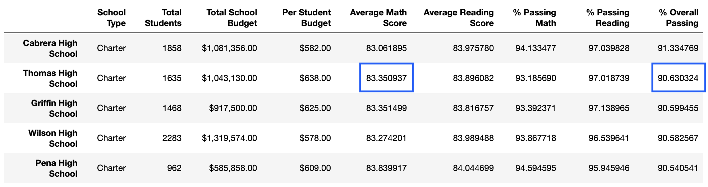
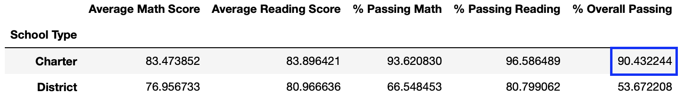
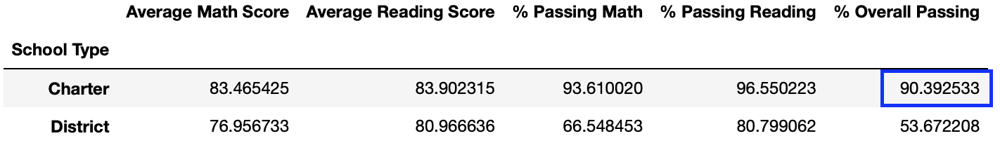

# School_District_Analysis

## Background and Overview

After conducting an in-depth analysis of a school district, the council-board has identified altered data and has requested in conjunction with Maria to redo that analysis by eliminating the reading and math degrees of 9th grade students. This new analysis will share information by executing the following:

- The district summary DataFrame 
- The school summary DataFrame 
- The top 5 performing schools, based on the overall passing rate 
- The bottom 5 performing schools, based on the overall passing rate 
- The average math score for each grade level from each school 
- The average reading score for each grade level from each school 
- The scores by school spending per student 
- The scores by school size 
- The scores by school type 

## Results 
* How is the district summary affected?

    When removing the Thomas High School 9th grade math and reading scores from the dataset the total schools and students numbers are not affected so the overall averages by district will be reported with the original school and students numbers. As you can see the Average Math Score went below for 0.1% meanwhile the Reading score remains the same. Percentage students passing math, reading and the overall were reduced no more than 0.3% due to there are 461 9th grade students at Thomas High School.

fig. 1: District Summary before removing 

fig. 2: District Sumary after removing

* How is the school summary affected?

    The School summary is not changing a lot beacuse we are using the toal number of students en each school to calculet the percentage of students passing math, reading and the overall. 

* How does replacing the ninth graders’ math and reading scores affect Thomas High School’s performance relative to the other schools?

    Althoug there was a reduction of the Average Math Score of 0.06 the Thomas High School still in the second place of the Top 5 High Schools

fig. 3: Top 5 schools before removing 

    

fig. 4: Top 5 schools after removing 

* How does replacing the ninth-grade scores affect the following:
    - Math and reading scores by grade : There are no 9th grade score in the updated data frame.
    - Scores by school spending : Due to the size of bins the averages math and reading stayed the same.
    - Scores by school size : Due to the size of school the averages math and reading stayed the same.
    - Scores by school type : We can see a dicrease of 0.04% in the Overall passing before and after removing the 9th graders.

fig. 5: Top 5 schools before removing 

  

fig. 6: Top 5 schools after removing 

  

## Summary 

