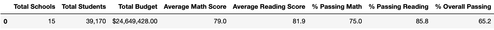

# School_District_Analysis

## Background and Overview

After conducting an in-depth analysis of a school district, the council-board has identified altered data and has requested in conjunction with Maria to redo that analysis by eliminating the reading and math degrees of 9th grade students. This new analysis will share information by executing the following:

- The district summary DataFrame 
- The school summary DataFrame 
- The top 5 performing schools, based on the overall passing rate 
- The bottom 5 performing schools, based on the overall passing rate 
- The average math score for each grade level from each school 
- The average reading score for each grade level from each school 
- The scores by school spending per student 
- The scores by school size 
- The scores by school type 

## Results 
* How is the district summary affected?

    When removing the THS 9th grade math and reading scores from the dataset the total chools and students numers are not affected so the overall averages by district will be reported with the original school and students numbers. As you can see the Average Math Score went below for 0.1% meanwhile the Reading score remains the same. Percentage students passing math, reading and the overall were reduced no more than 0.3% due to there are 461 9th grade students at Thomas High School.

fig. 1: 
    

fig. 2:
    

* How is the school summary affected?

* How does replacing the ninth graders’ math and reading scores affect Thomas High School’s performance relative to the other schools?

* How does replacing the ninth-grade scores affect the following:
    - Math and reading scores by grade
    - Scores by school spending
    - Scores by school size
    - Scores by school type

## Summary 

